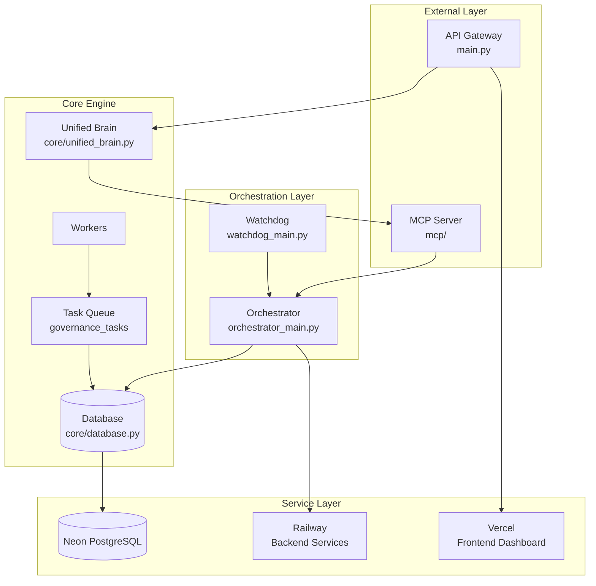
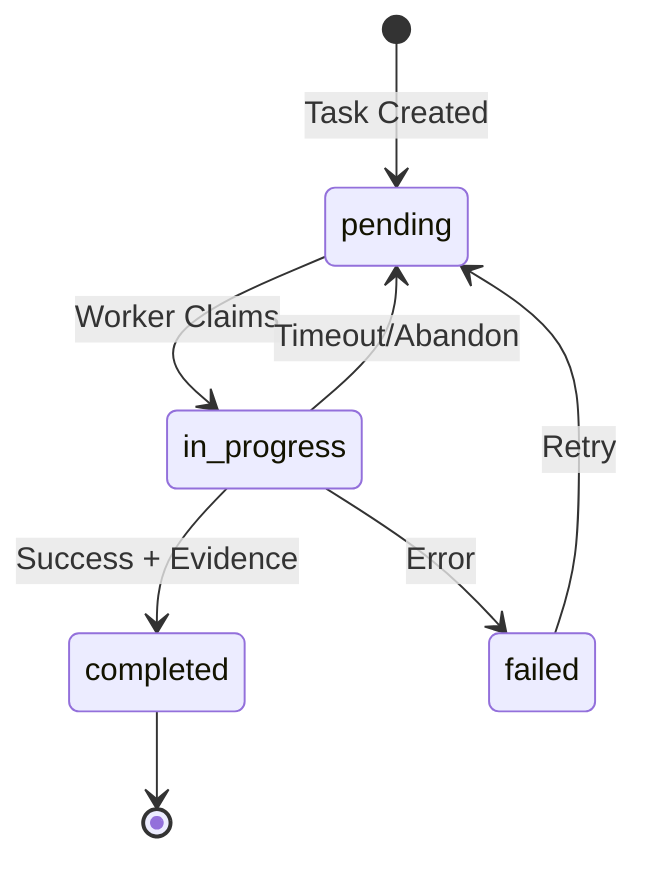

# JUGGERNAUT System Architecture

> A comprehensive guide to understanding JUGGERNAUT's autonomous business system architecture.

## Quick Start (15-minute overview)

JUGGERNAUT is an autonomous AI business system designed to scale from basic conversational AI (L1) to full organizational coordination (L5). The system uses a task-driven governance model where multiple AI workers claim and execute tasks from a central queue, coordinated by an orchestrator with monitoring and failover capabilities.

The system now features a **Unified Brain architecture** that centralizes AI reasoning and standardizes tool execution through the Model Context Protocol (MCP) server.



## System Overview

### Architecture Principles

1. **Task-Driven Governance**: All work flows through the `governance_tasks` table
2. **Atomic Operations**: Task claiming uses atomic SQL to prevent race conditions
3. **Graceful Degradation**: Systems fail safely with rollback capabilities
4. **Observable Operations**: Comprehensive logging and monitoring
5. **Human-in-the-Loop**: Escalation paths for critical decisions
6. **Unified Brain**: Centralized reasoning with standardized tool execution
7. **Strict Completion Semantics**: Code tasks complete only when PRs are merged

### Deployment Architecture

| Service | Platform | Purpose |
|---------|----------|---------|
| juggernaut-v3 | Railway | Primary API service |
| juggernaut-autonomy | Railway | Autonomy engine |
| juggernaut-engine | Railway | Background processing |
| Dashboard | Vercel | Frontend monitoring UI |
| Database | Neon PostgreSQL | Persistent storage |

## Directory Structure

```
juggernaut-autonomy/
├── core/                   # Core business logic (30 modules)
│   ├── unified_brain.py    # Unified Brain implementation
│   ├── mcp_tool_schemas.py # Tool definitions for OpenRouter
│   └── verification.py     # Task completion verification
├── agents/                 # AI agent definitions
├── api/                    # API route handlers
│   └── brain_api.py        # Unified Brain API endpoints
├── experiments/            # Experiment configurations
├── mcp/                    # MCP server implementation
│   └── server.py           # MCP server with tool execution
├── migrations/             # Database migrations
├── orchestrator/           # Orchestrator components
├── services/               # External service integrations
├── sql/                    # SQL scripts and queries
├── tests/                  # Test suites
├── docs/                   # Documentation
├── main.py                 # API entry point (100KB)
├── orchestrator_main.py    # Orchestrator entry point (18KB)
└── watchdog_main.py        # Watchdog entry point (14KB)
```

## Core Modules Reference

The `core/` directory contains 30 modules totaling ~700KB of business logic:

### Task Management

| Module | Size | Responsibility |
|--------|------|----------------|
| `orchestration.py` | 86KB | Main orchestration loop, task coordination, worker management |
| `scheduler.py` | 29KB | Task scheduling, cron-like job management |
| `task_batching.py` | 19KB | Groups related tasks for efficient processing |
| `task_validation.py` | 4KB | Validates task structure and dependencies |
| `stale_cleanup.py` | 7KB | Removes stale/abandoned tasks |

### Data Layer

| Module | Size | Responsibility |
|--------|------|----------------|
| `database.py` | 72KB | All database operations, queries, transactions |
| `connection_pool.py` | 18KB | Connection pooling and management |
| `secrets_vault.py` | 20KB | Secure credential storage and retrieval |

### AI & Agents

| Module | Size | Responsibility |
|--------|------|----------------|
| `unified_brain.py` | 120KB | Unified Brain with tool execution, OpenRouter integration |
| `agents.py` | 30KB | AI agent lifecycle, capabilities, registration |
| `mcp_factory.py` | 18KB | MCP (Model Context Protocol) server creation |
| `mcp_tool_schemas.py` | 25KB | Tool schemas for OpenRouter function calling |
| `tools.py` | 17KB | Tool definitions available to AI agents |

### Experiments & Learning

| Module | Size | Responsibility |
|--------|------|----------------|
| `experiments.py` | 57KB | A/B testing, hypothesis tracking, rollback |
| `learning_capture.py` | 19KB | Captures learnings for system improvement |
| `impact_simulation.py` | 28KB | Simulates impact before execution |

### Reliability & Recovery

| Module | Size | Responsibility |
|--------|------|----------------|
| `error_recovery.py` | 16KB | Error handling, dead letter queue |
| `failover.py` | 13KB | Failover mechanisms and backup systems |
| `conflict_manager.py` | 25KB | Multi-worker conflict resolution |
| `verification.py` | 10KB | Task completion verification |

### Scaling & Resources

| Module | Size | Responsibility |
|--------|------|----------------|
| `auto_scaling.py` | 37KB | Dynamic worker scaling based on queue depth |
| `resource_allocator.py` | 18KB | Resource allocation across tasks |

### Monitoring & Alerts

| Module | Size | Responsibility |
|--------|------|----------------|
| `monitoring.py` | 36KB | System health monitoring, metrics |
| `alerting.py` | 6KB | Alert rule definitions and triggers |
| `notifications.py` | 12KB | Multi-channel notification dispatch |
| `slack_notifications.py` | 13KB | Slack-specific integration |

### Automation & Proactive

| Module | Size | Responsibility |
|--------|------|----------------|
| `proactive.py` | 26KB | Proactive system actions |
| `automation_proposals.py` | 14KB | Suggests automation opportunities |
| `opportunity_scan_handler.py` | 5KB | Scans for business opportunities |
| `scanner_config.py` | 14KB | Scanner configuration management |

### Escalation

| Module | Size | Responsibility |
|--------|------|----------------|
| `escalation_manager.py` | 12KB | Escalation routing and handling |

## L1-L5 Autonomy Levels

JUGGERNAUT implements a graduated autonomy model:

### L1: Conversational AI ✅ COMPLETE
- **Core Capabilities**:
  - Basic chat interactions
  - Information retrieval
  - Simple Q&A
  - Short-term context
  - Session logging
- **Modules**: `agents.py`, `tools.py`
- **Status**: Complete and operational

### L2: Reasoners ✅ COMPLETE
- **Core Capabilities**:
  - Multi-turn memory
  - Chain-of-thought reasoning
  - Suggests actions
  - References & sourcing
  - Structured outputs
- **Modules**: `task_validation.py`, `verification.py`
- **Status**: Complete and operational

### L3: Agents ✅ CURRENT LEVEL
- **Core Capabilities**:
  - Goal/task acceptance
  - Workflow planning
  - Tool/API execution
  - Persistent task memory
  - Error recovery
  - Human-in-the-loop
  - Action logging
- **Modules**: `unified_brain.py`, `orchestration.py`, `escalation_manager.py`, `learning_capture.py`
- **Status**: Mostly complete, active development

### L4: Innovators ⚠️ IN PROGRESS
- **Core Capabilities**:
  - Proactive scanning
  - Experimentation
  - Hypothesis tracking
  - Self-improvement
  - Sandboxed innovation
  - Rollback
  - Proposes new automations
  - Impact simulation
- **Modules**: `experiments.py`, `error_recovery.py`, `auto_scaling.py`
- **Status**: Partially implemented

### L5: Organizations ❌ NOT YET
- **Core Capabilities**:
  - Goal decomposition
  - Multi-agent orchestration
  - Resource allocation
  - Cross-team conflict management
  - Org-wide memory
  - Advanced access control
  - Automated escalation
  - Resilience/failover
  - Executive reporting
- **Modules**: `conflict_manager.py`, `resource_allocator.py`, `impact_simulation.py`
- **Status**: Not yet implemented

## Data Flow

### Task Lifecycle



### Task Claiming (Atomic Operation)

```sql
UPDATE governance_tasks 
SET assigned_worker = 'worker-id', 
    status = 'in_progress',
    started_at = NOW()
WHERE id = 'task-id' 
  AND status = 'pending';
-- rowCount = 1 means claim succeeded
-- rowCount = 0 means another worker claimed it
```

## Entry Points

### main.py (API Gateway)
- FastAPI application
- REST endpoints for external integrations
- Health checks
- Dashboard API

### orchestrator_main.py (Orchestrator)
- Continuous orchestration loop
- Worker coordination
- Queue management
- Auto-recovery

### watchdog_main.py (Watchdog)
- Health monitoring
- Restart unhealthy services
- Alert on anomalies
- Escalation triggers

## Database Schema

See [SCHEMA.md](./SCHEMA.md) for complete schema documentation.

Key tables:
- `governance_tasks`: Central task queue
- `worker_registry`: Worker registration and status
- `experiments`: A/B test configurations
- `coordination_events`: Event log for debugging
- `learnings`: Captured system learnings

## Configuration

### Environment Variables

```bash
# Database
DATABASE_URL=postgresql://...
NEON_CONNECTION_STRING=postgresql://...

# Services
RAILWAY_API_TOKEN=...
VERCEL_TOKEN=...

# AI
OPENAI_API_KEY=...

# Monitoring
SLACK_WEBHOOK_URL=...

# Feature Flags
ENABLE_AUTO_SCALING=true
AUTO_SCALING_INTERVAL_SECONDS=300
```

### Railway Services

| Service ID | Name | Purpose |
|------------|------|---------|
| `596ef594-ea23-42dd-aff6-7ecc26ed7aad` | juggernaut-v3 | Main API |
| `5e97c188-dd37-4886-af81-0308874f7754` | juggernaut-autonomy | Autonomy Engine |
| `9b7370c6-7764-4eb6-a64c-75cce1d23e06` | juggernaut-engine | Background Jobs |

## Testing

```bash
# Run all tests
pytest

# Run with coverage
pytest --cov=core

# Run specific module tests
pytest tests/test_database.py
```

## Key Design Decisions

1. **PostgreSQL over NoSQL**: Relational integrity for task dependencies
2. **Atomic task claiming**: Prevents duplicate work across workers
3. **Event sourcing for coordination**: Full audit trail in `coordination_events`
4. **Gradual autonomy**: L1-L5 allows incremental trust building
5. **MCP integration**: Standardized tool interface for AI agents

## Related Documentation

- [API.md](./API.md) - API endpoint reference
- [SCHEMA.md](./SCHEMA.md) - Database schema details
- [DEVELOPMENT.md](./DEVELOPMENT.md) - Development setup
- [WORKER_INSTRUCTIONS.md](./WORKER_INSTRUCTIONS.md) - Worker protocol documentation
- [AUDIT_2026-02-01.md](./AUDIT_2026-02-01.md) - Latest system audit

## Quick Reference

### Common Operations

**Check pending tasks:**
```sql
SELECT * FROM governance_tasks WHERE status = 'pending' ORDER BY priority, created_at;
```

**View worker status:**
```sql
SELECT * FROM worker_registry WHERE last_heartbeat > NOW() - INTERVAL '5 minutes';
```

**Recent coordination events:**
```sql
SELECT * FROM coordination_events ORDER BY created_at DESC LIMIT 20;
```

### Module Import Map

```python
# Unified Brain
from core.unified_brain import BrainService

# Task management
from core.orchestration import run_orchestration_loop, get_orchestrator_dashboard
from core.scheduler import Scheduler
from core.task_batching import TaskBatcher

# Database
from core.database import get_task, update_task_status, log_coordination_event
from core.connection_pool import get_connection

# AI/Agents
from core.agents import AgentManager
from core.tools import get_available_tools
from core.mcp_tool_schemas import BRAIN_TOOLS

# Monitoring
from core.monitoring import SystemMonitor
from core.alerting import AlertManager
from core.slack_notifications import send_slack_alert

# Verification
from core.verification import CompletionVerifier
```

---

*Last updated: February 2026*
*Target audience: Developers new to JUGGERNAUT*
*Read time: ~15 minutes*
